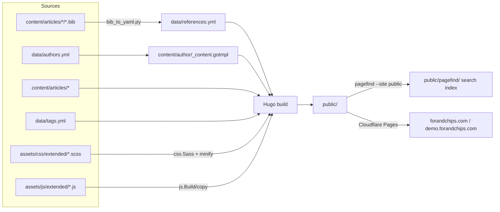
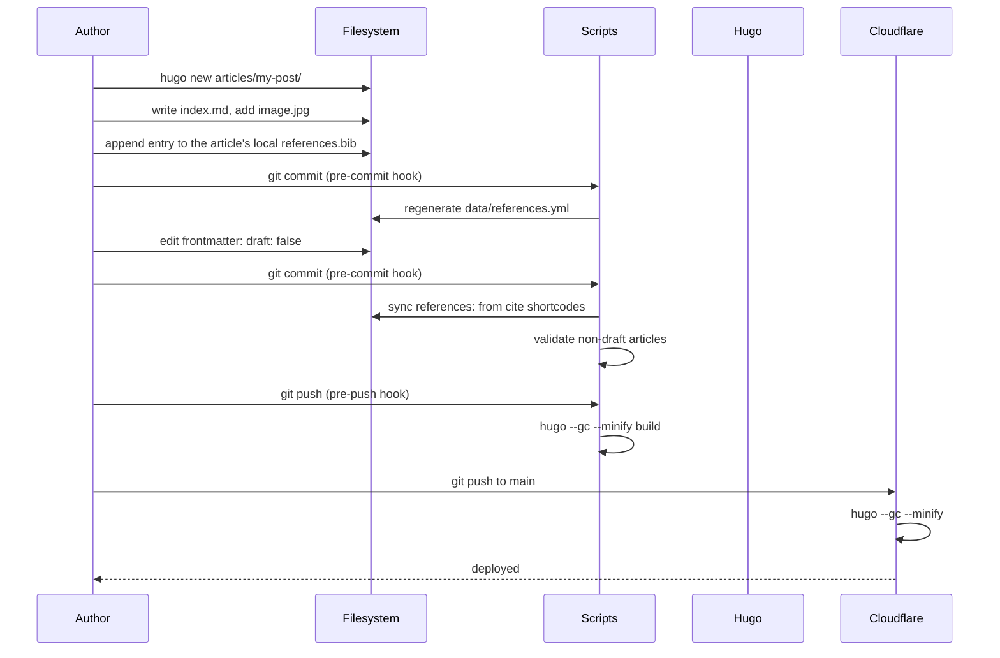

# Architecture

How the For&Chips blog is wired together: the stack, the source layout, the build pipeline, the data flow, and how a commit ends up online.

## Stack

| Layer            | Tool                                          |
| ---------------- | --------------------------------------------- |
| Static generator | [Hugo](https://gohugo.io) (extended)          |
| Theme base       | [PaperMod](https://github.com/adityatelange/hugo-PaperMod) (git submodule) |
| Styling          | SCSS via Hugo Pipes (`css.Sass`)              |
| Bibliography     | BibTeX → YAML (`scripts/bib_to_yaml.py`)      |
| Frontend JS      | Vanilla ES modules (no bundler)               |
| Search           | Pagefind (full text, post-build index) + Fuse.js fallback in dev |
| Graphs           | D3.js, vendored (collab + article-graph pages) |
| Validation       | Python (`scripts/validate.py` + friends)      |
| Hooks            | Bash in `.githooks/`                          |
| CI               | GitHub Actions                                |
| Hosting          | Cloudflare Pages — two projects: production + demo (`doc/deployment.md`) |

Hugo does the heavy lifting. Everything else exists to feed Hugo clean inputs or to push its outputs somewhere.

## Project layout

```
.
├── archetypes/articles/index.md   # scaffold for `hugo new`
├── assets/
│   ├── css/extended/              # SCSS partials added on top of PaperMod
│   └── js/extended/               # vanilla JS modules
├── content/
│   ├── articles/                  # the actual posts (one folder per post)
│   │   └── <slug>/*.bib           # BibTeX sources live next to each article
│   ├── bags/<slug>/_index.md      # curated article packs (see pages.md)
│   ├── tools/<slug>/index.md      # tool cards + pages
│   ├── authors/                   # _index.md only — pages generated from data/
│   ├── author/_content.gotmpl     # content adapter (one page per author)
│   └── ...                        # about, collab, article-graph
├── data/
│   ├── authors.yml                # author registry (source of truth)
│   ├── references.yml             # generated from .bib files
│   └── tags.yml                   # tag registry with display labels
├── layouts/                       # Hugo templates that override PaperMod
│   ├── articles.html              # /articles list page
│   ├── article/single.html        # individual post template
│   ├── authors.html               # /authors directory page
│   ├── author/single.html         # individual author page
│   ├── collab/single.html         # /collab graph page
│   ├── article-graph/single.html  # /article-graph page
│   ├── bags/list.html             # /bags index + /bags/<slug>
│   ├── tools/list.html            # /tools index
│   ├── tool/single.html           # /tools/<slug>
│   ├── index.html                 # homepage
│   ├── 404.html
│   ├── partials/                  # reusable fragments
│   └── shortcodes/                # , , ,
│                                  # , , 
├── scripts/                       # Python helpers + git hook backends
│   ├── bib_to_yaml.py             # .bib  → data/references.yml
│   ├── sync_citations.py          # frontmatter `references:` ←→ shortcodes
│   ├── validate.py                # consistency checks
│   └── check_commit.py            # pre-commit gate for non-draft articles
├── .githooks/                     # pre-commit / pre-push (activate via core.hooksPath)
├── .github/workflows/             # parse-bibliography.yml, validate.yml
├── themes/PaperMod                # git submodule
├── config/                        # Hugo config, per environment
│   ├── _default/hugo.yaml         # shared config (all params)
│   ├── production/hugo.yaml       # forandchips.com — SEO + analytics on
│   └── demo/hugo.yaml             # demo.forandchips.com — noindex, no analytics
└── wrangler.toml                  # Cloudflare Pages deploy config
```

## Build pipeline



The non-obvious arrows:

- **`bib_to_yaml.py`** runs in two places: locally via the `pre-commit` hook (when a `.bib` file is staged) and in CI via `parse-bibliography.yml` (when a `.bib` lands on `main`). Both regenerate `data/references.yml`.
- **`content/author/_content.gotmpl`** is a Hugo *content adapter*. It reads `data/authors.yml` at build time and produces one virtual page per author — there are no `.md` files for authors.
- **Pagefind** runs *after* Hugo and indexes the rendered article pages
  (scoped by `data-pagefind-body` in `layouts/article/single.html`) into
  `public/pagefind/`. The navbar search imports that index at runtime and
  falls back to Fuse + `/index.json` when it's absent (`hugo server`).
- **SCSS** is compiled by Hugo Pipes (`css.Sass`) inside `layouts/partials/extend_head.html`, fingerprinted, and inlined or linked depending on the partial.

## Data flow for one article



## Routing model

Hugo resolves a content file to a template by looking at its `type` and `layout`. Content sections in this project:

| Section            | URL          | `type` (frontmatter) | Template used                  |
| ------------------ | ------------ | -------------------- | ------------------------------ |
| `content/articles` | `/articles`  | (default)            | `layouts/articles.html`        |
| `content/articles/<slug>` | `/articles/<slug>` | `article` | `layouts/article/single.html`  |
| `content/authors`  | `/authors`   | (default)            | `layouts/authors.html`         |
| `content/author/<slug>` (virtual) | `/author/<slug>` | `author` | `layouts/author/single.html` |
| `content/collab`   | `/collab/...`| `collab`             | `layouts/collab/single.html`   |
| `content/article-graph` | `/article-graph/` | `article-graph` | `layouts/article-graph/single.html` |
| `content/bags`     | `/bags`, `/bags/<slug>` | (default) | `layouts/bags/list.html` (branches on path) |
| `content/tools`    | `/tools`     | (default)            | `layouts/tools/list.html`      |
| `content/tools/<slug>` | `/tools/<slug>` | `tool`        | `layouts/tool/single.html`     |
| `content/tags` (retired) | `/tags/…` → 301 `/articles/?tag=` | (default) | `layouts/tags/list.html` (redirect shim) |
| `content/_index.md`| `/`          | —                    | `layouts/index.html`           |
| anything else      | —            | —                    | `_default/baseof.html` chain   |

The article frontmatter must set `type: "article"` so Hugo picks `layouts/article/single.html` regardless of URL nesting. Same for authors.

## Environments & deploy

Hugo merges `config/_default/` with one environment overlay at build time —
the *branch* only decides content, the *build flag* decides behaviour:

| Environment | Command | Effect |
|---|---|---|
| production (default for `hugo`) | `hugo --minify && npx pagefind --site public` | forandchips.com baseURL, robots index + sitemap, GoatCounter on |
| demo | `hugo --minify --environment demo && npx pagefind --site public` | demo.forandchips.com baseURL, noindex meta, `Disallow: /` robots, no analytics |
| development (`hugo server`) | `hugo server -D` | noindex, Fuse search fallback |

Two Cloudflare Pages projects build from the same repo (`main` → production,
`demo` branch → demo). Full setup steps, custom domains and third-party
service configuration live in [`deployment.md`](deployment.md).

The `pre-push` hook runs `hugo --gc --minify -D=false` locally as a sanity net so a broken build never reaches Cloudflare.

## CI

| Workflow                  | Trigger                         | Action                                            |
| ------------------------- | ------------------------------- | ------------------------------------------------- |
| `parse-bibliography.yml`  | push to `main` touching any `.bib` (shared `bibliography/` or per-article `content/articles/**`) | Regenerate `data/references.yml`, commit it back. |
| `validate.yml`            | push / PR                       | Run `scripts/validate.py` against the full repo.  |

CI is the second line of defence — the hooks are the first.

## Where to look next

- Per-page breakdown → [`pages.md`](pages.md)
- Templates and shortcodes → [`templates.md`](templates.md)
- Styling tokens and SCSS layout → [`styles.md`](styles.md)
- JS, Python, hooks → [`scripts.md`](scripts.md)
- Data file schemas → [`data.md`](data.md)
