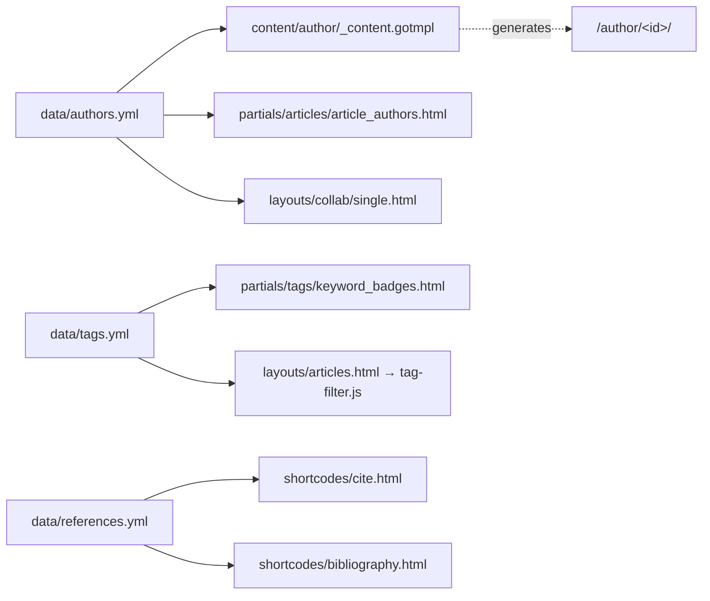

# Data

Schemas of every YAML file under `data/`, the article archetype, and the full frontmatter reference. These files are the source of truth — Hugo reads them at build time and the validator checks every article against them.

## `data/authors.yml`

The author registry. **Source of truth** — author pages, byline chips, and the collab graph all read from this.

Structure: top-level keys are author IDs (used in article frontmatter `authors[].id`). Convention: `firstname-lastname`, lowercase, hyphenated.

```yaml
alice-dupont:
  first_name: "Alice"
  last_name: "Dupont"
  role: "Researcher"            # free-form label; e.g. "Researcher", "Practitioner"
  description: "Short bio shown on the author page and hover cards."
  photo: "alice.png"            # filename in static/images/authors/ — empty string for no photo
  links:
    website: "https://alice.example.com"
    linkedin: "https://linkedin.com/in/alice"
    orcid:    "0000-0001-2345-6789"
    github:   ""                # empty string when not applicable
  current_affiliations:
    "Université X": "Professeure"
    "Laboratoire Z": "Chercheuse"
  keywords:                     # tags this author cares about; must exist in tags.yml
    - "protobuf"
    - "database"
    - "Android"
```

| Field                  | Required | Notes                                                             |
| ---------------------- | :------: | ----------------------------------------------------------------- |
| `first_name`           | yes      | Used in bylines.                                                  |
| `last_name`            | yes      | Used in bylines and citations.                                    |
| `role`                 | no       | Free-form label.                                                  |
| `description`          | yes      | One-paragraph bio.                                                |
| `photo`                | no       | Filename only. Photos live in `static/images/authors/`.           |
| `links.*`              | no       | Empty string = "no link". Validator allows missing keys.          |
| `current_affiliations` | no       | Map of `"Org": "Title"`. Order preserved in display.              |
| `keywords`             | no       | Each must match a key in `data/tags.yml`.                         |

## `data/tags.yml`

The tag registry. Defines which tags exist and their display label.

```yaml
keywords:
  mobile_forensic:
    label: "Mobile forensic"
  ios:
    label: "iOS"
```

| Field   | Required | Notes                                                                              |
| ------- | :------: | ---------------------------------------------------------------------------------- |
| `label` | yes      | Display string (humans see this).                                                  |

Tag **colours** do not live here: they are defined in the `$tags` SCSS map in
`assets/css/extended/tags.scss`, keyed by the same tag key. A tag missing from
either file still renders, with the raw key as label and the default chip
colour.

The key (e.g. `mobile_forensic`) is what appears in article frontmatter `tags:` arrays.

## `data/references.yml`

**Generated.** Do not edit by hand. `scripts/bib_to_yaml.py` reads every `.bib` in `bibliography/` and writes this file.

```yaml
carrier2005:
  authors: "Carrier, B."
  title:   "File System Forensic Analysis"
  type:    book                 # mirrors the BibTeX entry type
  year:    2005
  journal: "Addison-Wesley Professional"
  number:  ""
  pages:   ""
  volume:  ""
  doi:     ""
  url:     "https://www.amazon.com/dp/0321268172"
```

The keys (`carrier2005`) are the BibTeX cite keys. Articles reference them via `` and list them in their `references:` frontmatter array.

To add a reference: append to a `.bib` file, then commit. The `pre-commit` hook regenerates `data/references.yml`.

## Article archetype — `archetypes/articles/index.md`

The scaffold `hugo new content articles/<slug>/` copies. Every article begins as this:

```yaml
---
title: ""
date: <auto>
lastmod:
type: article            # required — controls template lookup
slug: ""                 # required — must match the folder name
draft: true              # flip to false when ready — pre-commit hook validates on next commit

authors:
  - id: ""               # author key from data/authors.yml

abstract: ""

tags: []                 # keys from data/tags.yml

# Cover image: place cover.png in images/ alongside this file
# images/cover.png

# List BibTeX keys from data/references.yml used in this post
references: []
---
```

## Full article frontmatter reference

Fields the validator and templates know about:

| Field                       | Required | Type      | Validator behaviour                                                          |
| --------------------------- | :------: | --------- | ---------------------------------------------------------------------------- |
| `title`                     | yes      | string    | Must be non-empty.                                                           |
| `date`                      | yes      | date      | Future date → warning (intentional scheduling allowed).                      |
| `lastmod`                   | no       | date      | If present, must be ≥ `date`.                                                |
| `type`                      | yes      | string    | Must be `"article"` or article template won't be picked.                     |
| `slug`                      | yes      | string    | Must match `^[a-z0-9]+(?:[-_][a-z0-9]+)*$` and equal the folder name.        |
| `draft`                     | no       | bool      | `true` skips Hugo render (without `-D`) and skips pre-commit validation. Flipping to `false` triggers full validation on the next commit. |
| `authors[].id`              | yes      | string    | Each ID must exist in `data/authors.yml`.                                    |
| `abstract`                  | yes      | string    | Used in cards, OG meta, and the article header.                              |
| `tags`                      | no       | string[]  | Each tag must exist in `data/tags.yml`.                                      |
| `references`                | no       | string[]  | Each key must exist in `data/references.yml`. Synced by `sync_citations.py`. |
| `cover` / `images/`         | no       | path      | If referenced, file must exist on disk.                                      |

## Article folder layout

```
content/articles/<slug>/
├── index.md           # the article + frontmatter
└── images/
    ├── cover.png      # auto-picked as the cover
    └── inline.png     # referenced from the body via 
```

Hugo treats the folder as a *page bundle*, so relative image paths Just Work.

## How the data files are consumed



## Editing rules

- **`authors.yml`** — edit by hand. Add, change, remove. Articles referencing a removed author will fail validation.
- **`tags.yml`** — edit by hand. Don't forget the SCSS map in `keywords.scss`.
- **`references.yml`** — never edit by hand. Edit the `.bib` source instead.
- **Archetype** — edit if every new article should change shape. Existing articles aren't migrated automatically.
